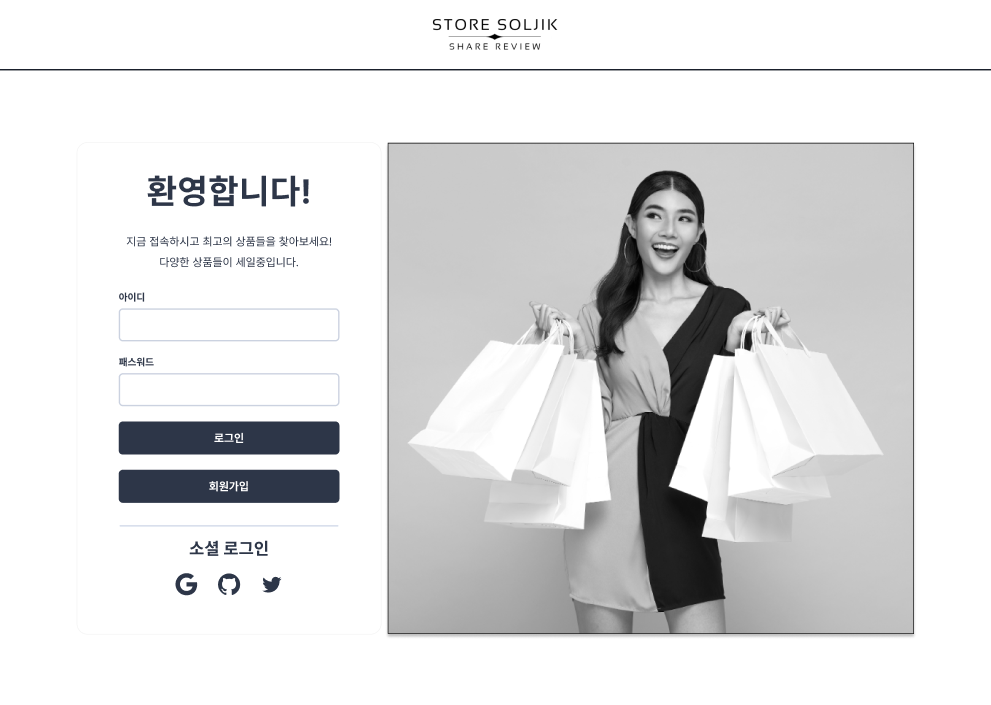

<a name="readme-top"></a>

<div align="center">
  

  <h3 align="center">스토어 솔직</h3>

  <p align="center">
    1인 개발 커머스 프로젝트 입니다.
    <br />
    
    <br />
    <a href="https://store-soljik.vercel.app/signin" >데모 사이트</a>
    <br />
    테스트 계정 : test@test.com / 1q2w3e4r!@
    <br />
    Contact : banghyechan@gmail.com
  </p>
</div>


<!-- TABLE OF CONTENTS -->
<details>
  <summary>Table of Contents</summary>
  <ol>
    <li>
      <a href="#프로젝트-소개">프로젝트 소개</a>
    </li>
    <li>
      <a href="#트러블-슈팅">트러블 슈팅</a>
    </li>
    <li>
      <a href="#최적화">최적화</a>
    </li>
    <li>
      <a href="#프로젝트-기술-스택">프로젝트 기술 스택</a>
    </li>
    <li>
      <a href="#브랜치-전략">브랜치 전략</a>
    </li>
    <li>
      <a href="#프로젝트-폴더-구조">프로젝트 폴더 구조</a>
    </li>
    <li>
      <a href="#커밋-컨벤션">커밋 컨벤션</a>
    </li>
    <li>
      <a href="#eslint">Eslint</a>
    </li>
    <li>
      <a href="#prettier">Prettier</a>
    </li>
  </ol>
</details>

<br />

<picture></picture>
<br />

## 프로젝트 소개
세상에는 수많은 종류의 커머스들이 존재합니다. 그러나, 리뷰에 관해서는 신뢰성이 보장되지 않는 플랫폼이 대다수입니다. 이 프로젝트는 그러한 불만을 해소하기 위해 만들어졌습니다.

**어떻게?**

상품마다 실시간 소통이 가능한 채팅 기능을 통해, 다른 회원 혹은 실제 구매자와 궁금한 점들을 소통할 수 있습니다.

상품의 실 구매자는 채팅창에 출력되는 뱃지를 통해 확인할 수 있습니다.

<br />

### 구현 기능(페이지 단위)
1. 로그인 페이지(자체 로그인 / 소셜 로그인 가능)
2. 회원가입 페이지
3. 구매자 페이지
  - 홈(인기 상품 / 카테고리 별 최신 상품)
  - 카테고리 별 상품 조회(카테고리를 통한 상품 필터링, 등록일 / 가격 기준 정렬)
  - 구매내역
4. 판매자 페이지
  - 판매 상품 관리(판매자가 등록한 상품 목록 확인 / CRUD 리다이렉트)
  - 주문 상태 관리(판매 상품 관련 주문 확인 / 주문 상태 변경)
  - 판매 상품 등록/업데이트

<br />

<picture></picture>
<br />

## 최적화
관련 내용은 gitbook 링크로 리다이렉트 됩니다.

1. <a href="https://iwannabethehashs-organization.gitbook.io/project-soljik-devlog/optimization/editor" >이미지 최적화</a>
2. <a href="https://iwannabethehashs-organization.gitbook.io/project-soljik-devlog/optimization/markdown" >Lazy Loading / Code Splitting</a>
3. <a href="https://iwannabethehashs-organization.gitbook.io/project-soljik-devlog/optimization/images-and-media" >렌더링 최적화</a>

<br />

## 트러블 슈팅
관련 내용은 gitbook 링크로 리다이렉트 됩니다.

1. <a href="https://iwannabethehashs-organization.gitbook.io/project-soljik-devlog/trouble-shooting/firebase-session" >BaaS(Firebase) 환경에서의 세션 관리</a>
2. <a href="https://iwannabethehashs-organization.gitbook.io/project-soljik-devlog/trouble-shooting/firebase-cors" >Firebase 저장소의 CORS 에러 해결</a>
3. <a href="https://iwannabethehashs-organization.gitbook.io/project-soljik-devlog/trouble-shooting/api" >다음 우편번호 API 적용하기</a>

<br />

<picture></picture>
<br />

## 프로젝트 기술 스택

프로젝트의 아키텍처와 기술 스택 선정 이유를 간략하게 설명합니다.


<br />

### Front-End
[![TypeScript][TypeScript]][TypeScript-url]
- 타입 안정성 확보
- 컴파일 타임에 에러 발견

<br />

[![React][React.js]][React-url]
- SPA 프로젝트 구현
- 컴포넌트 구조를 활용해 유지보수성, 재사용성 확보
- 거대한 커뮤니티와 확장성
  - [![ReactQuery][ReactQuery]][ReactQuery-url]
    - useInfiniteQuery : 대용량 데이터셋의 로딩 최적화
    - Optimistic Update : 활용한 빠른 UI 업데이트
  - [![ReactHookForm][ReactHookForm]][ReactHookForm-url]
    - Uncontrolled Component 기반으로 리렌더 최소화를 통한 성능 향상
    - 자체 validation 기능 제공

<br />

[![StyledComponent][StyledComponent]][StyledComponent-url]
- **TailwindCSS vs Styled-Component**
  1. 소규모 프로젝트 개발 속도 : **TailwindCSS**(utility 클래스 기반의 빠른 전역 스타일링) vs *Styled-Component*(컴포넌트 단위의 스타일링으로 재사용성 확보)
  2. 전역 theme, 커스텀 component 스타일 설정: **TailwindCSS**(`tailwind.config.js` 파일에 테마 지정, `global.css` 파일에 어노테이션 활용해 설정 가능) vs **Styled-Component**(객체 형태의 전역 theme, props 를 활용한 동적 스타일링 가능)
  3. 성능 최적화 : **TailwindCSS**(정적 CSS 클래스를 활용한 빠른 스타일 해석, 사용할 CSS만 번들링하여 크기 최소화) vs *Styled-Component*(스타일의 객체 단위 모듈화)
- 개발 속도나 성능을 고려하면 TailwindCSS 가 좋겠으나, 많이 사용되지만 한번도 사용해보지 않은 **Styled-Components** 의 사용법을 익혀보기로 결정.

<br />

### Back-End
[![Firebase][Firebase]][Firebase-url]
- NoSQL 기반으로 프로젝트의 기능 변동에 따른 DB 스키마 변경이 자유로움
- 대용량 데이터셋의 빠른 처리 속도
- 다양한 기능의 product 제공
  - 인증 서비스(Firebase Authentication)
  - NoSQL DB(FireStore)
  - 컨텐츠(이미지, 오디오, 비디오 등) 저장소(Clouc Storage)

<br />

### Deploy
[![Vercel][Vercel]][Vercel-url]
- Git 기반의 워크 플로우를 지원하여 Git Repo 기반으로 쉽고 빠른 배포가 가능

[![Vite][Vite]][Vite-url]
- Native ESM 기반의 빠른 개발 서버 지원
  - 모든 모듈 파일을 번들링하는 과정 대신 수정된 모듈만 dynamic import 를 통해 불러옴
  - HTTP 헤더를 활용해 소스코드와 디펜던시를 캐싱하여 페이지 로딩 최적화

<br />

### CI / CD
[![Github][Github]][Github-url]
- 브랜치 전략에 기반한 CI 적용

[![GithubActions][GithubActions]][GithubActions-url]
- Vercel 과의 연동을 통한 CD 적용

<br />

<picture></picture>
<br />

## 브랜치 전략
깃 플로우 방식에서 3가지 브랜치만 가져와서 사용

1. `main` : 프로젝트 배포에 사용하는 브랜치입니다.
2. `develop` : 배포되기 전 확인 작업을 위한 브랜치입니다.
3. `feature` : 개발을 위한 브랜치로, 기능 단위로 생성하여 사용하는 브랜치입니다.

<p align="right">(<a href="#readme-top">back to top</a>)</p>

<br />

## 프로젝트 폴더 구조
```
📁 src
 ├──📁 assets       // 이미지, 폰트 파일 등 프로젝트 내부에서 사용될 파일들을 저장합니다.
 │   ├──📁 fonts
 │   └──📁 images
 ├──📁 components   // 기능별로 코드를 세분화하여 컴포넌트로 저장합니다.
 │   ├──📁 ui
 │   └──📁 form
 │   └──📁 layouts
 ├──📁 pages        // 각 페이지의 컴포넌트, 하위 컴포넌트 폴더를 저장하고 관리합니다.
 ├──📁 router       // 페이지 라우팅 관련 파일을 저장합니다.
 ├──📁 hooks        // 전역적으로 사용되는 커스텀 hook 들을 저장합니다.
 ├──📁 utils        // 모든 유틸리티 기능들을 저장합니다.
 ├──📁 services     // 외부 API와 상호작용하는 모든 코드들을 저장합니다.
 ├──📁 style        // styled componets 에 사용할 글로벌 스타일이나 테마를 저장합니다.
 │   ├──📄 GlobalStyle.Styled.ts
 │   └──📄 theme.ts
 ├──📁 tests        // 모든 테스트 코드들을 저장합니다.
 ├──📄 App.tsx
 └──📄 main.tsx
```

<br />

## 코드 컨벤션
### 파일 이름
- Components, Styled Components : 파스칼 케이스
  - Styled Components 의 경우 컴포넌트명 뒤에 `.Styled` 를 붙입니다.
  - ex) `ProductList.tsx`, `PrudctList.Styled.ts`
- Context : 파스칼케이스 + Context 형태
  - ex) `ProductContext.ts`
- Hooks : 카멜케이스
  - ex) `useMyHook.ts`

### 변수명
기본적으로 카멜 케이스를 사용합니다. 특정 타입은 prefix 혹은 postfix 를 적용합니다.

|분류|Prefix/Postfix|예시|
|:-:|:-:|:-:|
|boolean|is(prefix)|isSeller|
|입력값|input(prefix)|inputPassword|
|array|Array(postfix)|productInfoArray|
|object|Obj(postfix)|basketObj|

### 함수명
기본적으로 카멜 케이스를 사용합니다. 특정 함수(이벤트 핸들러, CRUD)들의 경우 prefix 를 적용합니다.

|분류|Prefix|예시|
|:-:|:-:|:-:|
|이벤트 핸들러|handle|handleSubmitLogin()|
|Create|create|createProduct()|
|Read|read|readProductInfo()|
|Update|update|updateProductInfo()|
|Delete|delete|deleteProduct()|

### Styled-Components
이름은 파스칼 케이스로 작성하며, 컴포넌트의 최상위 태그명을 따라 postfix 를 붙여서 네이밍을 합니다.

레이아웃이나 UI 컴포넌트 중 html 태그에 기반한 컴포넌트를 작성할 경우, 최상위 태그의 이름에 `Styled` 라는 prefix 를 붙여서 실제 사용할 컴포넌트와 구분합니다.(ex. `StyledHeader`, `StyledButton`)

|최상위 태그|Postfix|예시|
|:-:|:-:|:-:|
|div|Box|ProductItemBox|
|ul, ol|List|ProductItemList|
|li|Item|ProductItem|
|header||StyledHeader|
|main||StyledMain|
|footer||StyledFooter|

Styled-Components 를 사용할 땐 S dot 네이밍을 사용합니다.

```jsx
import * as S from 'Product.Styled'

<S.ProductItem>
</S.ProductItem>
```

<br />

## 커밋 컨벤션
커밋은 가능한 하나의 문제 단위로 쪼개서 작성하여 알아보기 쉽게합니다. 커밋의 목적별로 Prefix 를 사용하며, 종류는 다음과 같습니다.

|Prefix|분류|예시|
|:-|:-:|:-:|
|**feat:**|기능 구현|feat: 로그인 페이지 구현|
|**fix:**|디버깅|fix: Product myHook 오류 수정|
|**modify:**|코드, 스타일 수정/삭제/최적화|modify: ProductList.tsx 컴포넌트 반응형 적용|
|**chore:**|설정(config, package.json), 프로젝트 구조 변경|chore: ProductList.tsx 컴포넌트 위치 변경, chore: package.json 의존성 업데이트|
|**docs:**|문서 업데이트|docs: README.md 업데이트|
|**assets:**|이미지, 폰트 업데이트|assets: 로그인 페이지 배경 이미지 업데이트|
|**test:**|테스트 코드 관련|test: Product CRUD API 테스트|

<br />

## Eslint
기본 설정 + 몇가지 룰 추가

```js
{
    rules: {
      'no-var': 'error',
      'eqeqeq': 'error',
      'dot-notation': 'error',
      'react/jsx-pascal-case': 'error',
    }
}
```

## Prettier
기본 설정 + 홑따옴표 사용

```json
{
  "singleQuote": true,
  "jsxSingleQuote": true,
  "tabWidth": 2,
}
```

<p align="right">(<a href="#readme-top">back to top</a>)</p>
<br />

<!-- MARKDOWN LINKS & IMAGES -->
<!-- https://www.markdownguide.org/basic-syntax/#reference-style-links -->
[TypeScript]: https://img.shields.io/badge/TypeScript-20232A?style=for-the-badge&logo=typescript&logoColor=61DAFB
[TypeScript-url]: https://www.typescriptlang.org/
[React.js]: https://img.shields.io/badge/React-20232A?style=for-the-badge&logo=react&logoColor=61DAFB
[React-url]: https://reactjs.org/
[ReactQuery]: https://img.shields.io/badge/react_query-FFF3F4?style=for-the-badge&logo=reactquery&logoColor=FF4154
[ReactQuery-url]: https://tanstack.com/query/latest/docs/framework/react/overview
[ReactHookForm]: https://img.shields.io/badge/react_hook_form-EC5990?style=for-the-badge&logo=reacthookform&logoColor=FFFFFF
[ReactHookForm-url]: https://react-hook-form.com/
[StyledComponent]: https://img.shields.io/badge/styled--components-FFF1FA?style=for-the-badge&logo=styledcomponents&logoColor=E871BF
[StyledComponent-url]: https://styled-components.com/
[Firebase]: https://img.shields.io/badge/firebase-FFC400?style=for-the-badge&logo=firebase&logoColor=E871BF
[Firebase-url]: https://firebase.google.com/
[Vite]: https://img.shields.io/badge/vite-B53EFE?style=for-the-badge&logo=vite&logoColor=FFCF27
[Vite-url]: https://ko.vitejs.dev/guide/
[Github]: https://img.shields.io/badge/github-FAFAFA?style=for-the-badge&logo=github&logoColor=000000
[Github-url]: https://docs.github.com/ko/actions
[GithubActions]: https://img.shields.io/badge/github_actions-F4F9FF?style=for-the-badge&logo=githubactions&logoColor=2088FF
[GithubActions-url]: https://docs.github.com/ko/actions
[Vercel]: https://img.shields.io/badge/Vercel-000000?style=for-the-badge&logo=vercel&logoColor=FFFFFF
[Vercel-url]: https://vercel.com/