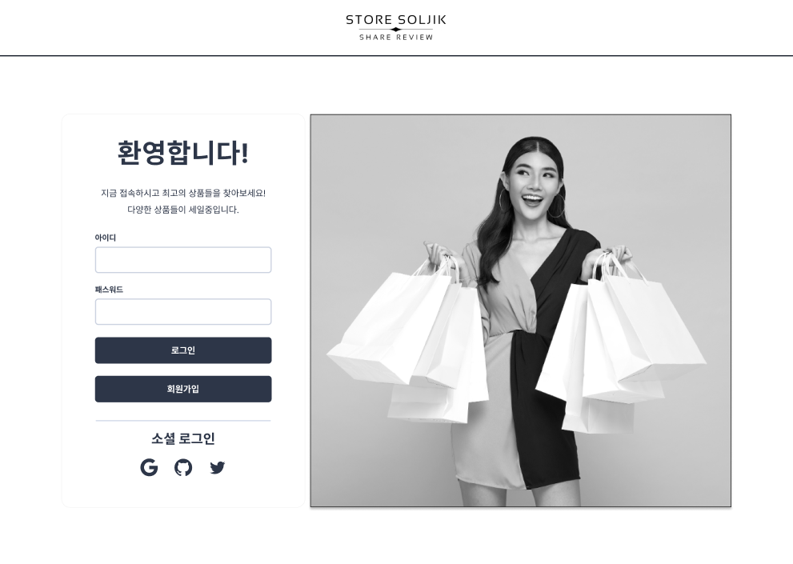
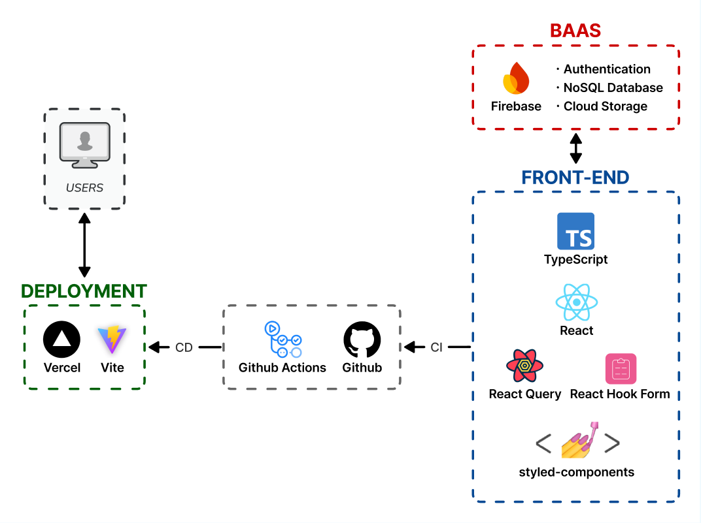

<a name="readme-top"></a>

<div align="center">
  

  <h3 align="center">스토어 솔직</h3>

  <p align="center">
    1인 개발 커머스 프로젝트 입니다.
    <br />
    
    <br />
    <a href="https://github.com/othneildrew/Best-README-Template" >데모 사이트</a>
    <br />
    테스트 판매자 계정 : momo1108@daum.net / 1q2w3e4r!@
    <br />
    테스트 구매자 계정 : test@test.com / 1q2w3e4r!@
    <br />
    Contact : banghyechan@gmail.com
  </p>
</div>


<!-- TABLE OF CONTENTS -->
<details>
  <summary>Table of Contents</summary>
  <ol>
    <li>
      <a href="#프로젝트-소개">프로젝트 소개</a>
    </li>
    <li>
      <a href="#프로젝트-기술-스택">프로젝트 기술 스택</a>
    </li>
    <li>
      <a href="#브랜치-전략">브랜치 전략</a>
    </li>
    <li>
      <a href="#프로젝트-폴더-구조">프로젝트 폴더 구조</a>
    </li>
    <li>
      <a href="#커밋-컨벤션">커밋 컨벤션</a>
    </li>
    <li>
      <a href="#eslint">Eslint</a>
    </li>
    <li>
      <a href="#prettier">Prettier</a>
    </li>
    <li>
      <a href="#prettier">Prettier</a>
    </li>
    <li>
      <a href="#관련-vscode-설정">관련 VSCode 설정</a>
    </li>
    <li>
      <a href="#트러블-슈팅">트러블 슈팅</a>
    </li>
    <li>
      <a href="#최적화">최적화</a>
    </li>
  </ol>
</details>

<br />

<picture></picture>
<br />

## 프로젝트 소개
세상에는 수많은 종류의 커머스들이 존재합니다. 그러나, 리뷰에 관해서는 신뢰성이 보장되지 않는다는 공통점이 존재합니다. 이 프로젝트는 그러한 불만을 해소하기 위해 만들어졌습니다.

**어떻게?**

> - 기존의 서비스들과 동일하게 리뷰와 평점 기능을 사용합니다.
> - 상품마다 실시간 소통이 가능한 채팅 기능을 통해, 실제 구매자와 궁금한 점들을 소통할 수 있습니다.

이 프로젝트의 목적은 단순한 기능개발 뿐 아니라, 최적화와 관련된 스킬을 익히는 것을 목적으로 합니다.

<br />

### 구현 기능
1. 회원가입 / 로그인 / 로그아웃
2. 판매자 판매상품 CRUD
3. 구매자 상품 조회, 구매


<p align="right">(<a href="#readme-top">back to top</a>)</p>

<br />
<br />

<picture></picture>
<br />

## 프로젝트 기술 스택

프로젝트의 아키텍처와 기술 스택 선정 이유를 간략하게 설명합니다.



<br />

### 선정 이유
<details>
  <summary><b>Front-End</b></summary>
<br>

[![TypeScript][TypeScript]][TypeScript-url]
- 타입 안정성 확보
- 컴파일 타임에 에러 발견

<br />

[![React][React.js]][React-url]
- SPA 프로젝트 구현
- 컴포넌트 구조를 활용해 유지보수성, 재사용성 확보
- 거대한 커뮤니티와 확장성
  - [![ReactQuery][ReactQuery]][ReactQuery-url]
    - useInfiniteQuery : 대용량 데이터셋의 로딩 최적화
    - Optimistic Update : 활용한 빠른 UI 업데이트
  - [![ReactHookForm][ReactHookForm]][ReactHookForm-url]
    - Uncontrolled Component 기반으로 리렌더 최소화를 통한 성능 향상
    - 자체 validation 기능 제공

<br />

[![StyledComponent][StyledComponent]][StyledComponent-url]
- **TailwindCSS vs Styled-Component**
  1. 소규모 프로젝트 개발 속도 : **TailwindCSS**(utility 클래스 기반의 빠른 전역 스타일링) vs *Styled-Component*(컴포넌트 단위의 스타일링으로 재사용성 확보)
  2. 전역 theme, 커스텀 component 스타일 설정: **TailwindCSS**(`tailwind.config.js` 파일에 테마 지정, `global.css` 파일에 어노테이션 활용해 설정 가능) vs **Styled-Component**(객체 형태의 전역 theme, props 를 활용한 동적 스타일링 가능)
  3. 성능 최적화 : **TailwindCSS**(정적 CSS 클래스를 활용한 빠른 스타일 해석, 사용할 CSS만 번들링하여 크기 최소화) vs *Styled-Component*(스타일의 객체 단위 모듈화)
- 개발 속도나 성능을 고려하면 TailwindCSS 가 좋겠으나, 많이 사용되지만 한번도 사용해보지 않은 **Styled-Components** 의 사용법을 익혀보기로 결정.


</details>

<details>
  <summary><b>Back-End</b></summary>
<br>

[![Firebase][Firebase]][Firebase-url]
- NoSQL 기반으로 프로젝트의 기능 변동에 따른 변경이 자유로움
- 대용량 데이터셋의 빠른 처리 속도
- 다양한 기능의 product 제공
  - 인증 서비스(Firebase Authentication)
  - NoSQL DB(FireStore)
  - 컨텐츠(이미지, 오디오, 비디오 등) 저장소(Clouc Storage)

<br />
<br />

</details>

<details>
  <summary><b>Deploy</b></summary>
<br>

[![Vercel][Vercel]][Vercel-url]
- Git 기반의 워크 플로우를 지원하여 Git Repo 기반으로 쉽고 빠른 배포가 가능

[![Vite][Vite]][Vite-url]
- Native ESM 기반의 빠른 개발 서버 지원
  - 모든 모듈 파일을 번들링하는 과정 대신 수정된 모듈만 dynamic import 를 통해 불러옴
  - HTTP 헤더를 활용해 소스코드와 디펜던시를 캐싱하여 페이지 로딩 최적화
 CD 적용

</details>

<details>
  <summary><b>CI/CD</b></summary>
<br>

[![Github][Github]][Github-url]
- 브랜치 전략에 기반한 CI 적용

[![GithubActions][GithubActions]][GithubActions-url]
- Vercel 과의 연동을 통한 CD 적용

</details>

<p align="right">(<a href="#readme-top">back to top</a>)</p>

<br />

<picture></picture>
<br />

## 브랜치 전략
깃 플로우 방식에서 3가지 브랜치만 가져와서 사용

1. `main` : 프로젝트 배포에 사용하는 브랜치입니다.
2. `develop` : 배포되기 전 확인 작업을 위한 브랜치입니다.
3. `feature` : 개발을 위한 브랜치로, 기능 단위로 생성하여 사용하는 브랜치입니다.

<p align="right">(<a href="#readme-top">back to top</a>)</p>

<br />

<picture></picture>
<br />

## 프로젝트 폴더 구조
```
📁 public
📁 src
 ├──📁 assets
 │   ├──📁 fonts
 │   └──📁 images
 ├──📁 components
 │   ├──📁 ui
 │   └──📁 form
 │   └──📁 layouts
 ├──📁 pages
 ├──📁 router
 ├──📁 hooks
 ├──📁 utils
 ├──📁 services
 ├──📁 style
 │   ├──📄 GlobalStyle.Styled.ts
 │   └──📄 theme.ts
 ├──📁 tests
 ├──📄 App.tsx
 └──📄 main.tsx
📄 config 파일들
📄 README.md
```

<details>
  <summary><b>구조 설명</b></summary>
<br>

|디렉토리명|역할|
|:---|:---|
|**assets**|프로젝트의 이미지, 폰트 파일 등 코드와 관련없는 파일들을 저장합니다.|
|**components**|기능별로 코드를 세분화하여 컴포넌트로 저장합니다.<br><br>1. 버튼, 모달, 카드 등의 사용자 인터페이스 요소가 포함된 ui 폴더<br>2. input, checkbox, date picker 등 form과 관련된 제어를 하기 위한 form 폴더<br>3. 사이드바나 내비게이션 바, 컨테이너 등 레이아웃을 기반으로 하는 layouts 폴더|
|**pages**|각 페이지의 폴더가 위치하며, 각 페이지의 루트 파일(index.tsx)과 해당 페이지에 속하는 모든 파일(ex. Login.Styled.ts, LoginForm.tsx 컴포넌트, useLogin.ts 훅)을 저장하여 페이지별 코드와 전역 코드를 분리합니다.<br>페이지 관련 코드를 한 곳에 모두 모아놓기 때문에, 이해하기가 쉬워집니다.|
|**router**|페이지 라우팅 관련 파일을 저장합니다.|
|**hooks**|여러 페이지에서 사용되는 전역 hook 들을 저장합니다. 특정 페이지에서만 사용되는 hook 은 해당 페이지 폴더에 저장합니다.|
|**utils**|모든 유틸리티 기능들을 저장합니다.|
|**services**|외부 API와 상호작용하는 모든 코드들을 저장합니다.(ex. Firebase 에서 상품 목록 불러오기 등의 비즈니스 로직 코드)|
|**style**|styled componets 에 사용할 글로벌 스타일이나 테마를 저장합니다.|
|**tests**|모든 테스트 코드들을 저장합니다.|

</details>

<p align="right">(<a href="#readme-top">back to top</a>)</p>
<br />

<picture></picture>
<br />

## 코드 컨벤션
### 파일 이름
- Components, Styled Components : 파스칼 케이스
  - Styled Components 의 경우 컴포넌트명 뒤에 `.Styled` 를 붙인다.
  - ex) `ProductList.tsx`, `PrudctList.Styled.ts`
- Context : 파스칼케이스 + Context 형태
  - ex) `ProductContext.ts`
- Hooks : 카멜케이스
  - ex) `useMyHook.ts`

### 변수명
기본적으로 카멜 케이스를 사용한다. 특정 타입은 prefix 혹은 postfix 를 적용한다.

|분류|Prefix/Postfix|예시|
|:-:|:-:|:-:|
|boolean|is(prefix)|isSeller|
|입력값|input(prefix)|inputPassword|
|array|Array(postfix)|productInfoArray|
|object|Obj(postfix)|basketObj|

### 함수명
기본적으로 카멜 케이스를 사용한다. 특정 함수(이벤트 핸들러, CRUD)들의 경우 prefix 를 적용한다.

|분류|Prefix|예시|
|:-:|:-:|:-:|
|이벤트 핸들러|handle|handleSubmitLogin()|
|Create|create|createProduct()|
|Read|read|readProductInfo()|
|Update|update|updateProductInfo()|
|Delete|delete|deleteProduct()|

### Styled-Components
이름은 파스칼 케이스로 작성하며, 컴포넌트의 최상위 태그명을 따라 postfix 를 붙여서 네이밍을 한다.

레이아웃이나 UI 컴포넌트 중 html 태그에 기반한 컴포넌트를 작성할 경우, 최상위 태그의 이름에 `Styled` 라는 prefix 를 붙여서 실제 사용할 컴포넌트와 구분한다.(ex. `StyledHeader`, `StyledButton`)

|최상위 태그|Postfix|예시|
|:-:|:-:|:-:|
|div|Box|ProductItemBox|
|ul, ol|List|ProductItemList|
|li|Item|ProductItem|
|header||StyledHeader|
|main||StyledMain|
|footer||StyledFooter|

Styled-Components 를 사용할 땐 S dot 네이밍을 사용한다.

```jsx
import * as S from 'Product.Styled'

<S.ProductItem>
</S.ProductItem>
```

<br />

<p align="right">(<a href="#readme-top">back to top</a>)</p>
<br />

<picture></picture>
<br />

## 커밋 컨벤션
커밋은 가능한 하나의 문제 단위로 쪼개서 작성하여 알아보기 쉽게 합니다. 커밋의 목적별로 Prefix 를 사용하며, 종류는 다음과 같습니다.

|Prefix|분류|예시|
|:-|:-:|:-:|
|**feat:**|기능 구현|feat: 로그인 페이지 구현|
|**fix:**|디버깅|fix: Product myHook 오류 수정|
|**modify:**|코드, 스타일 수정/삭제/최적화|modify: ProductList.tsx 컴포넌트 반응형 적용|
|**chore:**|설정(config, package.json), 프로젝트 구조 변경|chore: ProductList.tsx 컴포넌트 위치 변경, chore: package.json 의존성 업데이트|
|**docs:**|문서 업데이트|docs: README.md 업데이트|
|**assets:**|이미지, 폰트 업데이트|assets: 로그인 페이지 배경 이미지 업데이트|
|**test:**|테스트 코드 관련|test: Product CRUD API 테스트|

<p align="right">(<a href="#readme-top">back to top</a>)</p>
<br />

<picture></picture>
<br />

## Eslint
기본 설정 + 몇가지 룰 추가

```js
{
    rules: {
      'no-var': 'error',
      'eqeqeq': 'error',
      'dot-notation': 'error',
      'react/jsx-pascal-case': 'error',
    }
}
```

### 의존성
```json
{
  "devDependencies": {
    "@typescript-eslint/eslint-plugin": "^7.13.1",
    "@typescript-eslint/parser": "^7.13.1",
    "eslint": "^8.57.0",
    "eslint-config-prettier": "^9.1.0",
    "eslint-plugin-prettier": "^5.1.3",
    "eslint-plugin-react": "^7.34.3",
    "eslint-plugin-react-hooks": "^4.6.2",
    "eslint-plugin-react-refresh": "^0.4.7",
    "prettier": "^3.3.2",
  }
}
```

## Prettier
기본 설정 + 홑따옴표 사용

```json
{
  "singleQuote": true,
  "jsxSingleQuote": true,
  "tabWidth": 2,
}
```

## 관련 VSCode 설정
```json
{
  "editor.codeActionsOnSave": {
    "source.fixAll.eslint": "always"
  },
  "editor.defaultFormatter": "esbenp.prettier-vscode",
  "editor.formatOnSave": true
}
```

<p align="right">(<a href="#readme-top">back to top</a>)</p>
<br />

<picture></picture>
<br />

## 트러블 슈팅
### Firebase 연동
1. Firestore 에서의 데이터 filtering, ordering
2. Firebase authentication 서비스 적용

### React Query 적용
1. Optimistic Update 의 오작동 개선
2. 여러 필터링 조건에 따른 infiniteQuery 설정


<!-- MARKDOWN LINKS & IMAGES -->
<!-- https://www.markdownguide.org/basic-syntax/#reference-style-links -->
[TypeScript]: https://img.shields.io/badge/TypeScript-20232A?style=for-the-badge&logo=typescript&logoColor=61DAFB
[TypeScript-url]: https://www.typescriptlang.org/
[React.js]: https://img.shields.io/badge/React-20232A?style=for-the-badge&logo=react&logoColor=61DAFB
[React-url]: https://reactjs.org/
[ReactQuery]: https://img.shields.io/badge/react_query-FFF3F4?style=for-the-badge&logo=reactquery&logoColor=FF4154
[ReactQuery-url]: https://tanstack.com/query/latest/docs/framework/react/overview
[ReactHookForm]: https://img.shields.io/badge/react_hook_form-EC5990?style=for-the-badge&logo=reacthookform&logoColor=FFFFFF
[ReactHookForm-url]: https://react-hook-form.com/
[StyledComponent]: https://img.shields.io/badge/styled--components-FFF1FA?style=for-the-badge&logo=styledcomponents&logoColor=E871BF
[StyledComponent-url]: https://styled-components.com/
[Firebase]: https://img.shields.io/badge/firebase-FFC400?style=for-the-badge&logo=firebase&logoColor=E871BF
[Firebase-url]: https://firebase.google.com/
[Vite]: https://img.shields.io/badge/vite-B53EFE?style=for-the-badge&logo=vite&logoColor=FFCF27
[Vite-url]: https://ko.vitejs.dev/guide/
[Github]: https://img.shields.io/badge/github-FAFAFA?style=for-the-badge&logo=github&logoColor=000000
[Github-url]: https://docs.github.com/ko/actions
[GithubActions]: https://img.shields.io/badge/github_actions-F4F9FF?style=for-the-badge&logo=githubactions&logoColor=2088FF
[GithubActions-url]: https://docs.github.com/ko/actions
[Vercel]: https://img.shields.io/badge/Vercel-000000?style=for-the-badge&logo=vercel&logoColor=FFFFFF
[Vercel-url]: https://vercel.com/